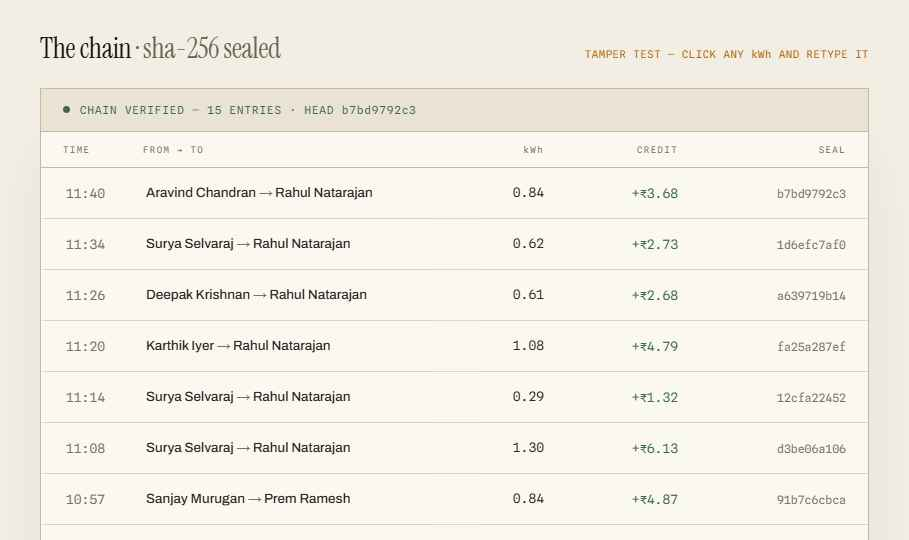
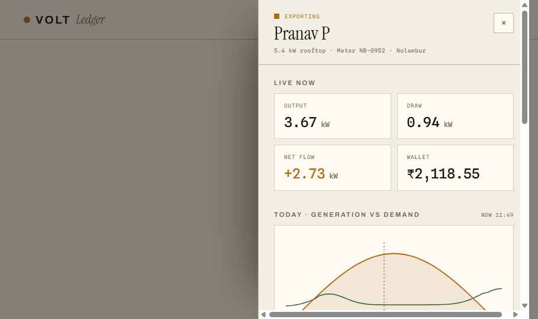
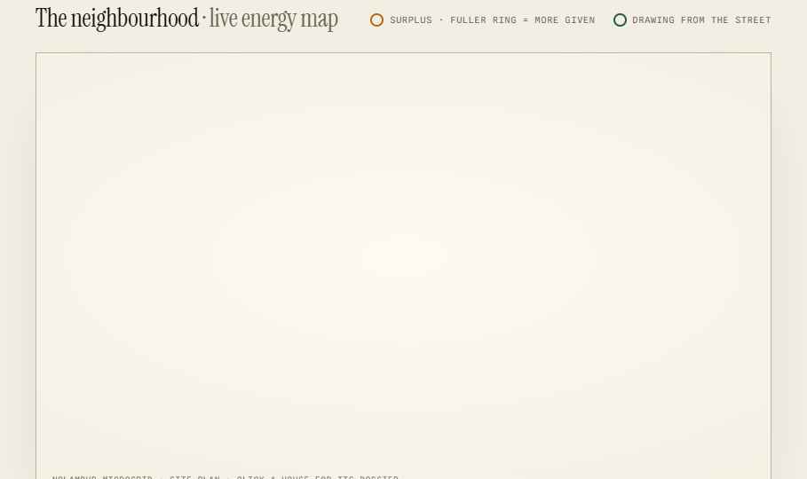
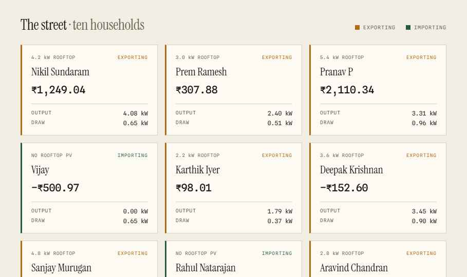

# Volt

**A transparent, tamper-evident ledger for peer-to-peer rooftop-solar energy trading.**

Volt turns a neighbourhood into a fair local energy market: households with surplus
solar sell it straight to the neighbours who need it, instead of dumping it to the grid
at a loss. Every kilowatt-hour is recorded to a shared hash chain, so no single operator
can quietly rewrite who owes whom.

Built for the Open Energy Challenge 2026. All data is simulated — nothing real was billed.


---

## The idea in one number

Today the grid buys your surplus at about ₹3.00/kWh and resells it next door at about
₹8.00/kWh. That ₹5.00 spread — roughly 62% of the retail price — leaves your street for a
balance sheet three districts away, even though the electron only travelled forty metres.
Volt clears the same trade at a community rate near ₹5.50: the seller earns more, the
buyer pays less, and a small fee runs the network. The value stays on the street.

## Two views

### `Volt.dc.html` — the landing page
The pitch. An animated neighbourhood network shows houses shifting between surplus
(giving) and deficit (drawing); an interactive **spread** chart contrasts the grid's
economics against Volt's community rate; a three-step explainer walks through
**Generate → Log → Settle**; and an honest *"why not just a database?"* table lays out the
trade-offs.

### `Ledger.dc.html` — the live ledger
A single solar afternoon on the Nolambur microgrid (Chennai), simulated in real time:

- **Live energy map** — a site plan of ten rooftops on a shared bus, with energy packets
  riding from givers to takers. Click any house for its full dossier.
- **The street** — ten household cards updating live as they export and import.
- **The chain** — every trade sealed into a SHA-256 hash chain, computed live in your browser.
- **Per-household dossier** — rooftop spec, a generation-vs-demand curve for the day, and
  today's trade activity.

## The tamper test — the whole point

Each entry's seal is `SHA-256(previous seal + entry payload)`. Because every seal folds in
the one before it, the record is only trustworthy as long as it's unbroken.

On the live ledger, **click any kWh figure and retype it.** That row and *every row after
it* immediately fail verification, an `INTEGRITY VOID` stamp drops onto the chain, and
settlement halts. Hit **Re-seal** to restore the original figures and the chain verifies
clean again.

The hashing is real — Web Crypto (`crypto.subtle`), with a pure-JS fallback — not faked.
It's the argument for a chain over a plain database, made tangible.

## Screenshots

| | |
|---|---|
|  |  |
| The tamper-evident chain | Per-household dossier |
|  |  |
| Live neighbourhood map | Ten households, live |

## Running it

No build step and nothing to install. The pages are self-contained HTML backed by a small
runtime (`support.js`) that ships in the repo.

Because the pages load web fonts and use the Web Crypto API, serve the folder over a local
static server rather than opening the files via `file://`:

```bash
# from the project root
python3 -m http.server 8000
```

Then open:

- <http://localhost:8000/Volt.dc.html>
- <http://localhost:8000/Ledger.dc.html>

Any static server works (`npx serve`, etc.). The two pages link to each other, so you can
navigate between them.

## Tweakable parameters

Both pages expose a few simulation knobs:

- **`simSpeed`** — how fast the simulated clock runs.
- **`startHour`** — the hour of day the simulation opens on.
- **`activity`** *(landing page)* — how busy the hero network animation is.

## Project structure

```
.
├── Volt.dc.html      # Landing page — the pitch + animated network
├── Ledger.dc.html    # Live ledger — map, households, hash chain, tamper test
├── support.js        # Runtime (no external dependencies)
└── screenshots/      # Preview images used in this README
```

## Notes

- **All data is simulated.** Households, balances, and trades are generated in the browser
  for demonstration. Nothing real was metered or billed.
- Motion respects `prefers-reduced-motion` — animations stand down when the OS asks.

